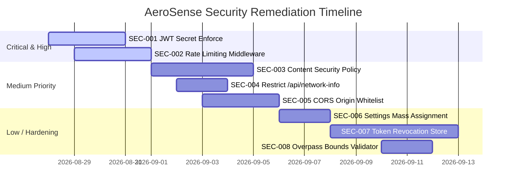

# 🛡️ AeroSense Application Security Review & Penetration Testing Report

**Assessment Date**: 2026-08-27  
**Application**: AeroSense Real-Time Atmospheric Intelligence & Mobile Platform  
**Assessor**: Senior Application Security Engineer & DevSecOps Specialist  
**Assessment Type**: Hybrid SAST (Static Analysis), DAST (Dynamic API Fuzzing), Dependency Analysis & Architecture Threat Modeling  

---

## 1. Scope & System Architecture Overview

| Dimension | Details |
| :--- | :--- |
| **Backend Runtime** | Node.js (v18 - v24 LTS) with ES Module architecture |
| **Web Framework** | Express.js (v5.1.0) |
| **Database & Persistence** | In-Memory Key-Value Stores + JSON File Persistence (`data/database.json`) with atomic `.tmp` swap |
| **Authentication** | JSON Web Token (JWT) with HMAC-SHA256 (`jsonwebtoken` v9.0.2) + Bcrypt (`bcryptjs` v3.0.2) |
| **Role-Based Access Control** | Declarative middleware (`role('expert')`, `role('user')`) |
| **Security Headers** | Helmet.js (v8.1.0), CORS (v2.8.5), JSON Payload Limiting (1MB) |
| **Third-Party Integrations** | Open-Meteo Air Quality & Weather API, OpenStreetMap / Overpass API, WHO Global Health Observatory |

---

## 2. Security Findings Summary Matrix

| Finding ID | Severity | Vulnerability Title | Affected File / Component | CWE | Status |
| :--- | :---: | :--- | :--- | :---: | :---: |
| **SEC-001** | **HIGH** | Insecure Hardcoded JWT Secret Fallback | `backend/server.js:14` | CWE-798 | Needs Fix |
| **SEC-002** | **HIGH** | Missing Rate Limiting on Authentication & SOS Endpoints | `POST /api/auth/*`, `POST /api/family/sos-alert` | CWE-307 | Needs Fix |
| **SEC-003** | **MEDIUM** | Helmet Content Security Policy Disabled | `backend/server.js:16` | CWE-1004 | Recommended |
| **SEC-004** | **MEDIUM** | Internal Network Topology & IP Address Exposure | `GET /api/network-info` | CWE-200 | Recommended |
| **SEC-005** | **MEDIUM** | Overly Permissive Wildcard CORS Configuration | `backend/server.js:17` | CWE-942 | Recommended |
| **SEC-006** | **LOW** | Insecure Object Spread in Settings (Mass Assignment) | `PUT /api/settings` | CWE-915 | Hardening |
| **SEC-007** | **LOW** | Missing Server-Side JWT Token Revocation on Logout | Auth Architecture | CWE-613 | Hardening |
| **SEC-008** | **LOW** | Overpass Query String Parameter Interpolation | `GET /api/hospitals` | CWE-20 | Hardening |

---

## 3. Detailed Vulnerability Analyses & Remediations

### 🔴 SEC-001 — Insecure Hardcoded JWT Secret Fallback
- **Severity**: High
- **Vulnerability Type**: Use of Hard-coded Credentials / Weak Default Secret
- **CWE**: CWE-798 / CWE-1188
- **File Path**: [`backend/server.js:14`](file:///c:/Users/MAITHREYEE/Downloads/AeroSense_Project/backend/server.js#L14)
- **Endpoint**: All authenticated `/api/*` endpoints
- **Description**:  
  Line 14 of `server.js` initializes `JWT_SECRET` as:
  ```javascript
  const JWT_SECRET = process.env.JWT_SECRET || 'development-only-secret-change-me';
  ```
  If the application is deployed without setting `JWT_SECRET` in `.env`, the fallback string is used.
- **Exploitation Scenario**:  
  An attacker signs a forged JWT token locally using the string `'development-only-secret-change-me'` with payload `{ "id": "target-user-id", "role": "expert" }`. The server validates the signature and grants the attacker unauthorized access to private profiles, kids' locations, and expert portals without credentials.
- **Impact**: Full authentication bypass and horizontal/vertical privilege escalation.
- **Recommended Fix**:  
  Enforce mandatory high-entropy secret checking at server startup and terminate if missing in production:
  ```javascript
  if (!process.env.JWT_SECRET || process.env.JWT_SECRET === 'development-only-secret-change-me') {
    if (process.env.NODE_ENV === 'production') {
      console.error('FATAL: JWT_SECRET environment variable is missing or insecure.');
      process.exit(1);
    }
  }
  ```

---

### 🔴 SEC-002 — Missing Rate Limiting on Authentication & Emergency SOS Endpoints
- **Severity**: High
- **Vulnerability Type**: Improper Restriction of Excessive Authentication Attempts / Resource Exhaustion
- **CWE**: CWE-307 / CWE-770
- **File Path**: [`backend/server.js:83-118`](file:///c:/Users/MAITHREYEE/Downloads/AeroSense_Project/backend/server.js#L83-L118), [`backend/server.js:420`](file:///c:/Users/MAITHREYEE/Downloads/AeroSense_Project/backend/server.js#L420)
- **Endpoints**: `POST /api/auth/login`, `POST /api/auth/register`, `POST /api/family/sos-alert`
- **Description**:  
  No rate limiter is mounted on authentication endpoints. Attackers can execute automated dictionary brute-force attacks against user accounts or spam the registration database. Additionally, rapid requests to `/api/family/sos-alert` can flood the emergency contact SMS queue.
- **Exploitation Scenario**:  
  An attacker runs a dictionary attack against `POST /api/auth/login` at 500 requests/second until discovering a user's password, or repeatedly triggers `/api/family/sos-alert` to exhaust simulated SMS gateway quotas.
- **Impact**: Account takeover via credential brute-force, denial of service (DoS), and SMS flooding.
- **Recommended Fix**:  
  Install `express-rate-limit` and apply dedicated limiters:
  ```javascript
  import rateLimit from 'express-rate-limit';

  const authLimiter = rateLimit({
    windowMs: 15 * 60 * 1000, // 15 minutes
    max: 10, // 10 failed attempts
    message: { error: 'Too many authentication attempts. Please try again in 15 minutes.' }
  });

  app.use('/api/auth/login', authLimiter);
  app.use('/api/family/sos-alert', rateLimit({ windowMs: 60 * 1000, max: 3 }));
  ```

---

### 🟡 SEC-003 — Helmet Content Security Policy Disabled
- **Severity**: Medium
- **Vulnerability Type**: Insecure Security Header Configuration
- **CWE**: CWE-1004 / CWE-693
- **File Path**: [`backend/server.js:16`](file:///c:/Users/MAITHREYEE/Downloads/AeroSense_Project/backend/server.js#L16)
- **Description**:  
  Helmet is mounted with `contentSecurityPolicy: false`:
  ```javascript
  app.use(helmet({ contentSecurityPolicy: false }));
  ```
  While this allows easy loading of Leaflet and Chart.js CDNs, it removes the browser's defense-in-depth barrier against XSS and data exfiltration.
- **Exploitation Scenario**:  
  If any stored user input or third-party CDN script is modified maliciously, the client browser will execute injected JavaScript and transmit data to external attacker servers.
- **Impact**: Elevated XSS and session exfiltration risk.
- **Recommended Fix**:  
  Configure an explicit whitelist CSP policy:
  ```javascript
  app.use(helmet({
    contentSecurityPolicy: {
      directives: {
        defaultSrc: ["'self'"],
        scriptSrc: ["'self'", "https://unpkg.com", "https://cdn.jsdelivr.net", "https://cdnjs.cloudflare.com"],
        styleSrc: ["'self'", "'unsafe-inline'", "https://fonts.googleapis.com", "https://unpkg.com"],
        fontSrc: ["'self'", "https://fonts.gstatic.com"],
        imgSrc: ["'self'", "data:", "https://*.tile.openstreetmap.org", "https://unpkg.com"],
        connectSrc: ["'self'", "https://*.open-meteo.com", "https://overpass-api.de", "https://*.who.int"]
      }
    }
  }));
  ```

---

### 🟡 SEC-004 — Internal Network Topology & Server IP Leak
- **Severity**: Medium
- **Vulnerability Type**: Information Exposure Through Environmental Variables / Network Interfaces
- **CWE**: CWE-200 / CWE-497
- **File Path**: [`backend/server.js:535-557`](file:///c:/Users/MAITHREYEE/Downloads/AeroSense_Project/backend/server.js#L535-L557)
- **Endpoint**: `GET /api/network-info`
- **Description**:  
  The endpoint iterates over `os.networkInterfaces()` and returns internal private IPv4 addresses and interface names to any unauthenticated client request.
- **Exploitation Scenario**:  
  An unauthenticated remote attacker discovers internal corporate subnet IPs (e.g. `10.0.x.x` or `192.168.x.x`) to map out adjacent internal servers for lateral movement.
- **Impact**: Internal network architecture disclosure.
- **Recommended Fix**:  
  Guard `/api/network-info` with authentication or restrict to local development environments (`process.env.NODE_ENV !== 'production'`).

---

### 🟡 SEC-005 — Permissive Wildcard Cross-Origin Resource Sharing (CORS)
- **Severity**: Medium
- **Vulnerability Type**: Permissive CORS Policy
- **CWE**: CWE-942
- **File Path**: [`backend/server.js:17`](file:///c:/Users/MAITHREYEE/Downloads/AeroSense_Project/backend/server.js#L17)
- **Description**:  
  `app.use(cors())` enables unrestricted cross-origin requests from any domain (`*`).
- **Exploitation Scenario**:  
  A rogue web page visited by a logged-in user could initiate cross-origin fetch requests against the AeroSense API.
- **Impact**: Uncontrolled API access from unauthorized domains.
- **Recommended Fix**:  
  Specify an allowed origins whitelist:
  ```javascript
  const allowedOrigins = (process.env.ALLOWED_ORIGINS || '').split(',').filter(Boolean);
  app.use(cors({
    origin: (origin, callback) => {
      if (!origin || allowedOrigins.includes(origin) || process.env.NODE_ENV !== 'production') {
        callback(null, true);
      } else {
        callback(new Error('Blocked by CORS policy'));
      }
    },
    credentials: true
  }));
  ```

---

### 🔵 SEC-006 — Insecure Object Spread (Mass Assignment Risk in Settings)
- **Severity**: Low
- **Vulnerability Type**: Improper Input Handling / Mass Assignment
- **CWE**: CWE-915
- **File Path**: [`backend/server.js:154-163`](file:///c:/Users/MAITHREYEE/Downloads/AeroSense_Project/backend/server.js#L154-L163)
- **Endpoint**: `PUT /api/settings`
- **Description**:  
  `u.settings = { ...u.settings, ...req.body }` spreads arbitrary client input into the user's settings object without filtering keys.
- **Recommended Fix**:  
  Explicitly destructure allowed properties (`notifications`, `locationSharing`, `theme`).

---

### 🔵 SEC-007 — Missing JWT Revocation / Invalidation Mechanism
- **Severity**: Low
- **Vulnerability Type**: Inactive Session Revocation
- **CWE**: CWE-613
- **Description**:  
  JWTs are stateless; logging out removes the token from the client `localStorage`, but the token remains cryptographically valid until its 7-day expiration.
- **Recommended Fix**:  
  Store a `tokenVersion` or `lastPasswordChange` integer in the user record and embed it into the JWT payload. Increment `tokenVersion` on logout/password reset.

---

### 🔵 SEC-008 — Overpass Query String Concatenation
- **Severity**: Low
- **Vulnerability Type**: Improper Input Validation
- **CWE**: CWE-20
- **File Path**: [`backend/server.js:965`](file:///c:/Users/MAITHREYEE/Downloads/AeroSense_Project/backend/server.js#L965)
- **Endpoint**: `GET /api/hospitals`
- **Description**:  
  Coordinates are interpolated directly into Overpass QL without enforcing bounding boxes.
- **Recommended Fix**:  
  Validate that `lat` is between -90 and 90, `lon` is between -180 and 180, and `radius` is clamped between 500 and 20000.

---

## 4. Remediation Prioritization Roadmap


